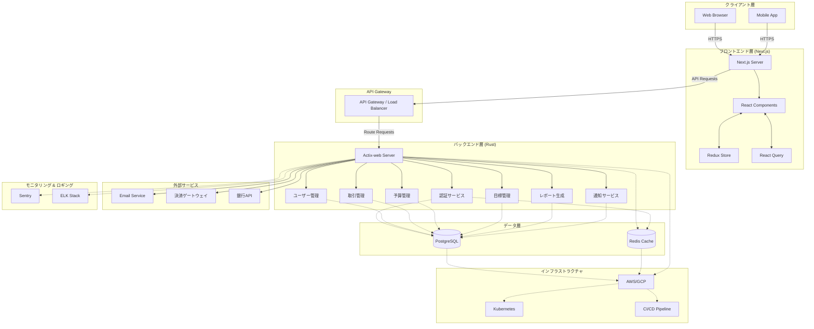

# FinFlow: 技術的検討

## 1. バックエンド（[Rust](https://www.rust-lang.org/ja)）

### 1.1 フレームワーク選択
- **[Actix-web](https://actix.rs/)**: 高性能で柔軟性が高い。非同期処理に優れている。
- **[Rocket](https://rocket.rs/)**: 使いやすさに重点を置いており、開発速度が速い。
- **[Axum](https://docs.rs/axum/latest/axum/)**: 最速のレスポンスとして評価されている

### 1.2 データベース
- **[PostgreSQL](https://www.postgresql.org/)**: 関係データベースとして信頼性が高く、金融データの整合性維持に適している。
- **ORM**: [SQLx](https://docs.rs/sqlx/latest/sqlx/)を使用してデータベース操作を行う。しかし、生のSQLを書く必要があるので以下の点に気をつける。
    1. クエリの構築時に必ずパラメータ化を行い、SQLインジェクションを防ぐ
    2. アプリケーションレベルで強力なバリデーション層を実装する。例えば、入力データの検証や、ビジネスルールに基づくチェックを行う。
    3. データベースアクセスを抽象化したリポジトリパターンを採用し、セキュリティとバリデーションのロジックを集中管理する。
    4. マイグレーション管理のために、別途ツール（例：Refinery）の導入を検討する。
- **移行管理**: [Refinery](https://docs.rs/refinery/latest/refinery/)を使用してデータベースマイグレーションを管理。

### 1.3 認証・認可
- **[JWT (JSON Web Tokens)](https://jwt.io/introduction)**: ステートレスな認証に使用。
- **[Argon2](https://ja.wikipedia.org/wiki/Argon2)**: パスワードハッシュ化に使用（セキュリティ強度が高い）。
- **[OAuth2](https://auth0.com/jp/intro-to-iam/what-is-oauth-2)**: 将来的なソーシャルログイン実装のために準備。

### 1.4 API設計
- **[RESTful API](https://ja.wikipedia.org/wiki/Representational_State_Transfer)**: 標準的なHTTPメソッドとステータスコードを使用。
- **OpenAPI (Swagger)**: API仕様の文書化と自動生成されたクライアントコードの利用。

### 1.5 非同期処理
- **[Tokio](https://tokio.rs/tokio/tutorial)**: 非同期ランタイムとして使用。
- **背景ジョブ**: バックグラウンドタスク（例：定期的な取引の自動記録）には[lapin](https://tokio.rs/tokio/tutorial)（RabbitMQ client）を検討。

## 2. フロントエンド（React / Next.js）

### 2.1 状態管理
- **[Redux Toolkit](https://redux-toolkit.js.org/introduction/why-rtk-is-redux-today)**: 大規模なアプリケーション状態管理に適している。
- **React Query**: サーバー状態の管理と同期に使用。

### 2.2 UIコンポーネント
- **Tailwind CSS**: カスタマイズ可能なユーティリティファーストのCSSフレームワーク。
- **Shadcn/ui**: 再利用可能なコンポーネントライブラリ。

### 2.3 グラフ・可視化
- **Recharts**: Reactに最適化されたグラフライブラリ。財務データの視覚化に使用。

### 2.4 フォーム管理
- **React Hook Form**: パフォーマンスと使いやすさに優れたフォームライブラリ。
- **Zod**: 型安全なスキーマ検証ライブラリ。

### 2.5 認証
- **NextAuth.js**: Next.jsアプリケーションに適した認証ライブラリ。

## 3. インフラストラクチャ

### 3.1 ホスティング
- **バックエンド**: AWS ECS（Elastic Container Service）またはGCP Cloud Run
- **フロントエンド**: Vercel（Next.jsに最適化されている）

### 3.2 データベースホスティング
- AWS RDS or GCP Cloud SQL for PostgreSQL

### 3.3 キャッシュ
- Redis: セッション管理や高速なデータアクセスのために使用。

### 3.4 CI/CD
- GitHub Actions: 継続的インテグレーションと継続的デプロイメントの自動化。

### 3.5 モニタリングとロギング
- **アプリケーションモニタリング**: Sentry
- **ログ管理**: ELK Stack (Elasticsearch, Logstash, Kibana) or Datadog

## 4. セキュリティ

### 4.1 データ暗号化
- **転送時の暗号化**: TLS 1.3
- **保存時の暗号化**: AES-256

### 4.2 セキュリティヘッダー
- **Helmet**: セキュリティ関連のHTTPヘッダーの設定

### 4.3 CORS (Cross-Origin Resource Sharing)
- 適切なCORS設定による、承認されたオリジンからのリクエストのみの許可

### 4.4 レート制限
- **アクティブレート制限**: DoS攻撃からの保護

### 4.5 依存関係の脆弱性スキャン
- **cargo-audit (Rust)**: Rustの依存関係の脆弱性チェック
- **npm audit (JavaScript)**: npm パッケージの脆弱性チェック

## 5. パフォーマンス最適化

### 5.1 バックエンド
- **接続プーリング**: データベース接続の効率的な管理
- **キャッシング**: 頻繁にアクセスされるデータのRedisキャッシング

### 5.2 フロントエンド
- **コード分割**: 動的インポートによる初期ロード時間の短縮
- **画像最適化**: Next.jsの画像最適化機能の利用

### 5.3 CDN (Content Delivery Network)
- Cloudflare or AWS CloudFront: 静的アセットの配信高速化

## 6. スケーラビリティ

### 6.1 水平スケーリング
- コンテナオーケストレーション（Kubernetes）の準備

### 6.2 データベーススケーリング
- 読み取りレプリカの設定
- 将来的なシャーディング戦略の検討

### 6.3 マイクロサービスアーキテクチャ
- 将来的な機能分割を見据えたモジュラー設計

## システムアーキテクト図

